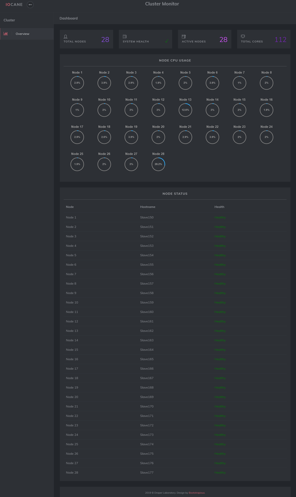

# Iocane Cluster Monitor UI
This repository is a monitoring system for a cluster of raspberry pi's. A python
script uses ssh to login to each raspberry pi in the network and retrieves their 
CPU usage info. It then writes the retrieved information to a json file 
(node_info.json).

### Web UI Screenshot

### Getting Started
In order to install and start a new monitoring cluster of raspberry pi's, here 
are the steps:

On the head node (raspberry pi):
1. Setup apache web server: `sudo apt-get update && sudo apt-get install apache2 -y`
2. `git clone https://gitlab.com/rubensl/iocane-cluster-monitor-ui.git`
3. `sudo mv iocane-cluster-monitor-ui/* /var/www/html`
4. Configure nodes.txt to correspond to the list of nodes to monitor by IP (or hostname if configured on the head node)
5. Start up backend of monitoring application: `sudo python3 web_ui.py`

Testing Web UI:
1. Go to preferred web browser and search http://[Head_Node_IP]